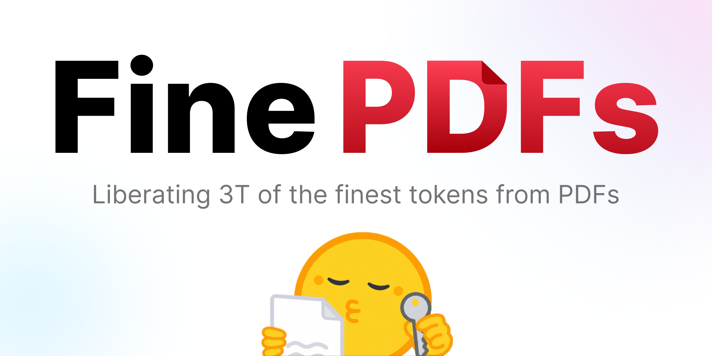

## FinePDFs: code and pipelines for the FinePDFs dataset

This repository accompanies the FinePDFs dataset release and contains the end‑to‑end code to filter, extract, OCR, postprocess, deduplicate, classify, and package large‑scale PDF text data.

- Dataset card: [HuggingFaceFW/finepdfs](https://huggingface.co/datasets/HuggingFaceFW/finepdfs)


### Installation

This project uses a workspace setup with vendored Docling and a specific `datatrove` branch. We recommend `uv`:

```bash
pip install uv
uv venv -p 3.12
source .venv/bin/activate
uv sync
```

Requirements are in [pyproject.toml](./pyproject.toml) (notable: `torch==2.6.0`, `vllm>=0.8.5.post1`, `pymupdf==1.26.1`). A GPU is needed recommended for vLLM steps.

### Quickstart
All steps are orchestrated by [run_finepdfs_pipeline.py](./run_finepdfs_pipeline.py).

Example run:

```bash
python run_finepdfs_pipeline.py \
  --crawl-ids CC-MAIN-2019-43 \
  --languages eng_Latn \
```

Notes:
- The pipeline is a rough reproduction of our production pipeline. Some parts are optimized for clarity rather than optimal resource allocation or speed.
- In the production pipeline we used LMDeploy instead of vLLM. As we decided not to support LMDeploy here, we use vLLM. For production use cases we recommend LMDeploy, as we found it to be the fastest of the sglang, vLLM, LMDeploy trio.

### OCR vs no‑OCR classifier
The trained OCR routing classifier is in [models/xgb_ocr_classifier/](./models/xgb_ocr_classifier/). Training code and features are in [models/model_prep_code/ocr_xgb_classifier_train/train_xgb_classifier.ipynb](./models/model_prep_code/ocr_xgb_classifier_train/train_xgb_classifier.ipynb). The manually annotated training dataset is released at `HuggingFaceFW/ocr-annotations`.

### OpenVINO‑quantized Docling layout model
We provide the code used to quantize/convert `ds4sd/docling-layout-heron` to INT8 with OpenVINO. We only provide code for quantization, not conversion (which is straightforward to reproduce). We do not provide the source PDFs/images used, so consider this a reference implementation rather than fully runnable code. Evaluation code is provided in a similar form.


### Language filtering thresholds
We first used `google/gemma-3-27b-it` as a classifier on a random subsample of 20k samples per language, prompting the LLM to check if a sample is in the language (any portion counts due to code‑switching). Using these annotations, we selected thresholds that maximize the F‑beta score with \(\beta = 0.1\) (heavily prioritizing precision), with minimum recall 0.1, minimum precision 0.9, and a minimum score cutoff to ensure reasonable thresholds.

During filtering, we pick the first `(language, score)` pair with `score > language_threshold`. If none qualifies and we have a threshold for the top language, we mark the sample for removal; otherwise we route it to the top language.

Gemma‑labeled dataset: `HuggingFaceFW/finepdfs_lang_classification`
```
python thresholds/find_th.py --min-recall=0.1 --min-precision=0.9 --min-score=0.1 --workers=11 --th_file=th_values.json
```
To run Gemma classification, see [thresholds/gemma_classify.py](./thresholds/gemma_classify.py).

### Quality classifier training
We evaluated the following filters/classifiers:
- `dclm`
- `ocr quality`
- `edu`
- `edu v2 (beyond undergraduate‑level textbooks)`

Prompts are in the labeling code. We found only `edu` and `dclm` to yield meaningful gains, with `edu` clearly leading. For non‑English languages we provide a BERT‑based `edu` classifier. For English, we provide a multi‑head classifier on top of ModernBERT for efficient multi‑task inference. The threshold selected is by taking top-10% of scores.

For labeling we used `Qwen3-235B-A22B-Instruct-2507`, which most closely matched Claude Sonnet 3.7 among open‑source LLMs.

Code:
- [classification/label_data_with_teacher.py](./classification/label_data_with_teacher.py) (labeling)
- [classification/train_classifier.sh](./classification/train_classifier.sh) (training)

Datasets/models:
- `HuggingFaceFW/finepdfs_fw_edu_labeled` (edu labeling for all languages)
- `HuggingFaceFW/finepdfs_edu_classifier_{language}` (distilled edu classifier)
- `HuggingFaceFW/finepdfs_{dclm|ocr_quality}_classifier_eng_Latn` (distilled dclm/OCR‑quality classifier)
- `HuggingFaceFW/finepdfs_edu_classifier_v2_eng_Latn` (distilled edu v2 classifier)


### Repository structure (where things live)

- Pipeline orchestration
  - [run_finepdfs_pipeline.py](./run_finepdfs_pipeline.py): full end‑to‑end driver with functions per step (filter, dedup, extraction, postprocess, exact dedup, model classification, minhash, push).
  - [pipeline_utils](./pipeline_utils/): pipeline‑related utilities
- Building blocks and utilities
  - [blocks/extractors/docling.py](./blocks/extractors/docling.py): `DoclingExtractor` for embedded‑text extraction via Docling.
  - [blocks/predictor/ocr_predictor.py](./blocks/predictor/ocr_predictor.py): scanned‑PDF predictor (XGBoost) to route OCR vs. non‑OCR.
  - [blocks/classification](./blocks/classification/): fast multi‑headed inference for distilled edu models.
- Vendored Docling code (exact versions used), modified for better performance/extraction clarity.
  - [docling_code/docling/](./docling_code/docling/), [docling_code/docling-core/](./docling_code/docling-core/), [docling_code/docling-ibm-models/](./docling_code/docling-ibm-models/) (each has its own README and LICENSE).

- Models and training assets
  - XGBoost OCR classifier weights: [models/xgb_ocr_classifier/](./models/xgb_ocr_classifier/) (trained with [models/model_prep_code/ocr_xgb_classifier_train](./models/model_prep_code/ocr_xgb_classifier_train/), used by [blocks/predictor/ocr_predictor.py](./blocks/predictor/ocr_predictor.py)).
  - OpenVINO quantized docling layout model: [models/heron/](./models/heron/) (quantized with [models/model_prep_code/docling_quant/](./models/model_prep_code/docling_quant/)).
  - Model based filtering training code (Edu/Dclm): [classification](./classification/) (`classification/train_classifier` for training, [classification/label_data_with_teacher.py](./classification/label_data_with_teacher.py) for labeling)

- Language filtering
  - Threshold discovery: [thresholds/](./thresholds/)

### Limitations (high‑level)

- Docling: extracts embedded text only; content in images is missed; tables/equations may misalign; possible paragraph order issues.
- OCR: may hallucinate or miss text, especially for low‑resource languages; page‑level failures may occur.
- Filtering: we minimize ML‑based filtering to avoid systematic content biases; harmful content may remain.

For context and trade‑offs, see the dataset card: [HuggingFaceFW/finepdfs](https://huggingface.co/datasets/HuggingFaceFW/finepdfs)


### License
- Dataset: ODC‑By 1.0; subject also to CommonCrawl terms.
- Code: Top‑level code in this repository is licensed under AGPL‑3.0. Vendored components under `docling_code/*` retain their original licenses (Docling and Docling‑Core under MIT; Docling‑IBM‑Models per upstream). The evaluation tooling under [models/model_prep_code/docling_quant/docling_eval](./models/model_prep_code/docling_quant/docling_eval) is licensed under MIT (same as Docling). PyMuPDF is used for rendering and is AGPL‑3.0. See [THIRD_PARTY_NOTICES.md](./THIRD_PARTY_NOTICES.md) for details.

### Citation

```
@misc{kydlicek2025finepdfs,
  title        = {FinePDFs},
  author       = {Hynek Kydl{\'\i}{\\v{c}}ek and Guilherme Penedo and Leandro von Werra},
  year         = {2025},
  publisher    = {Hugging Face},
  journal      = {Hugging Face repository},
  howpublished = {\url{https://huggingface.co/datasets/HuggingFaceFW/finepdfs}}
}
```